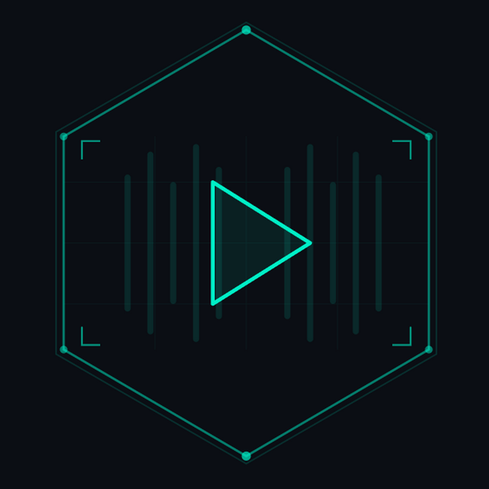

# ⬡ HoloWave

> **A holographic cyberpunk music player for Android — inspired by Cyberpunk 2077**

<p align="center">
  
</p>

<p align="center">
  
  
  
  
</p>

---

HoloWave is an offline music player built with Flutter, designed with a **Cyberpunk 2077-inspired aesthetic**. It scans your local music files and presents them as holographic grid tiles with inverted album art — complete with animated visualizer, blurred backgrounds, media notification controls, and a neon-drenched interface.

---

## ✨ Features

### 🎵 Audio Playback
- Full queue management with `ConcatenatingAudioSource` for gapless playback
- Shuffle and repeat modes (off / all / one)
- Background playback with media notification
- **Album art per track** in notifications with prev/pause/next controls
- Artwork extracted from embedded MP3 metadata

### 🖥 Holographic UI
- **Grid tile layout** — albums/folders/artists displayed as square holographic tiles
- **Negative/inverted album art** on each tile for a hologram effect
- Cyberpunk 2077 color palette: **cyan, yellow, red, purple**
- Corner bracket decorations on tiles
- Scanline overlay effects
- Animated bar visualizer on now-playing screen
- **Blurred album art** background on the player screen
- Animated boot sequence on startup

### 📁 Library Management
- Browse by **folders**, **albums**, or **artists** in tile grid
- Tap a tile to open its track list
- **Play All** button on each tile detail view
- Full-text search across title, artist, and album
- Configurable root folder to limit scan scope

### 📋 Playlists
- Create, delete, and manage custom playlists
- Add songs via long-press context menu
- Persistent storage using SharedPreferences

### 🎨 Now Playing
- Album artwork with animated visualizer overlay
- Blurred album art background with gradient
- Full controls: shuffle / previous / play-pause / next / repeat
- Seek bar with elapsed/total time
- Queue position indicator

### 🔔 Notification Controls
- Media notification with per-track album art
- Previous / Pause / Next buttons
- Seek bar with progress
- Powered by `just_audio_background` + `audio_service`

---

## 🏗 Architecture

```
lib/
├── main.dart                        # Entry point, boot screen
├── theme/
│   └── cyber_theme.dart             # CP2077 color palette & theme
├── models/
│   └── song.dart                    # Song & Playlist data models
├── services/
│   ├── audio_player_service.dart    # ConcatenatingAudioSource queue
│   ├── music_scanner.dart           # MediaStore scanner
│   └── playlist_service.dart        # SharedPreferences persistence
├── providers/
│   └── music_provider.dart          # Central ChangeNotifier state
├── screens/
│   ├── app_shell.dart               # 3-tab scaffold (Waves/Stacks/System)
│   ├── home_screen.dart             # Holographic grid tiles + detail view
│   ├── playlists_screen.dart        # Playlist management
│   ├── settings_screen.dart         # Root folder + rescan
│   └── now_playing_screen.dart      # Full player with visualizer
└── widgets/
    ├── mini_player.dart             # Bottom bar with artwork + controls
    ├── song_tile.dart               # Tappable full-row song tile
    └── cyber_widgets.dart           # ScanlineOverlay, CyberDivider
```

---

## 🔧 Tech Stack

| Component | Technology |
|-----------|-----------|
| Framework | Flutter 3.x |
| State Management | Provider + ChangeNotifier |
| Audio Playback | `just_audio` + `ConcatenatingAudioSource` |
| Notifications | `just_audio_background` + `audio_service` |
| Media Scanning | `on_audio_query` (Android MediaStore) |
| Permissions | `permission_handler` |
| Audio Focus | `audio_session` |
| Streams | `rxdart` |
| Persistence | `shared_preferences` |

---

## 🚀 Getting Started

### Prerequisites

- Flutter SDK 3.x+
- Android SDK (compileSdk 36)
- Java 17
- Android 7.0+ device or emulator

### Installation

```bash
git clone https://github.com/0x80070006/holowave.git
cd holowave
flutter pub get
flutter run
```

### Build Release APK

```bash
flutter build apk --release
# Output: build/app/outputs/flutter-apk/app-release.apk
```

---

## ⚙️ Configuration

### Root Folder
Go to **SYSTEM** tab → **SELECT ROOT FOLDER** to limit which directory is scanned.

### Build Config

| Setting | Value |
|---------|-------|
| `compileSdk` | 36 |
| `targetSdk` | 36 |
| `minSdk` | 24 |
| AGP | 8.7.3 |
| Kotlin | 2.1.0 |
| Gradle | 8.11.1 |

---

## 🐛 Troubleshooting

### Gradle lock errors (Windows)
```powershell
.\android\gradlew.bat --stop
taskkill /F /IM java.exe
Remove-Item -Recurse -Force .\android\.gradle\, .\build\
flutter clean && flutter pub get && flutter run
```

### No music found
Push test files: `adb push song.mp3 /sdcard/Music/`

### Notification art not updating
Art is extracted from MP3 metadata. Use [Mp3tag](https://www.mp3tag.de/) to embed cover art.

---

## 📄 License

MIT License — see [LICENSE](LICENSE)

---

## 🙏 Acknowledgements

- [just_audio](https://pub.dev/packages/just_audio) — Audio engine
- [on_audio_query](https://pub.dev/packages/on_audio_query) — MediaStore scanner
- [audio_service](https://pub.dev/packages/audio_service) — Notification controls
- Aesthetic inspired by **Cyberpunk 2077** by CD Projekt Red

---

<p align="center">
  <strong>⬡ Built with holograms and waveforms ⬡</strong>
</p>
